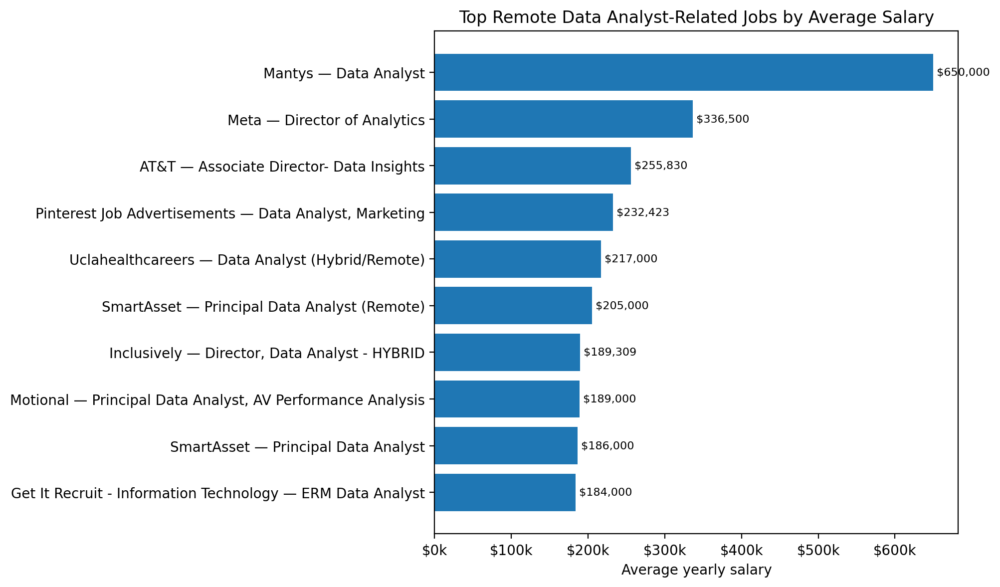
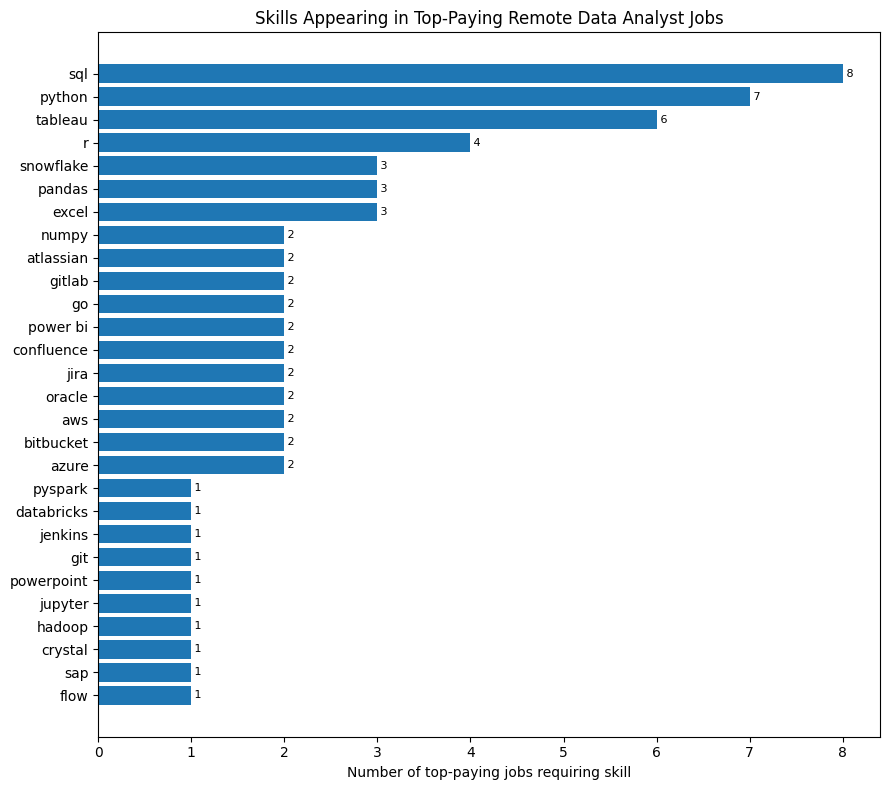
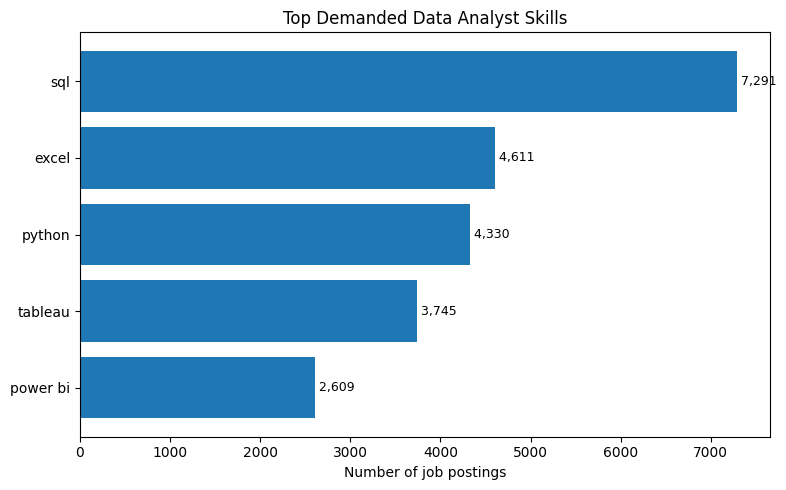
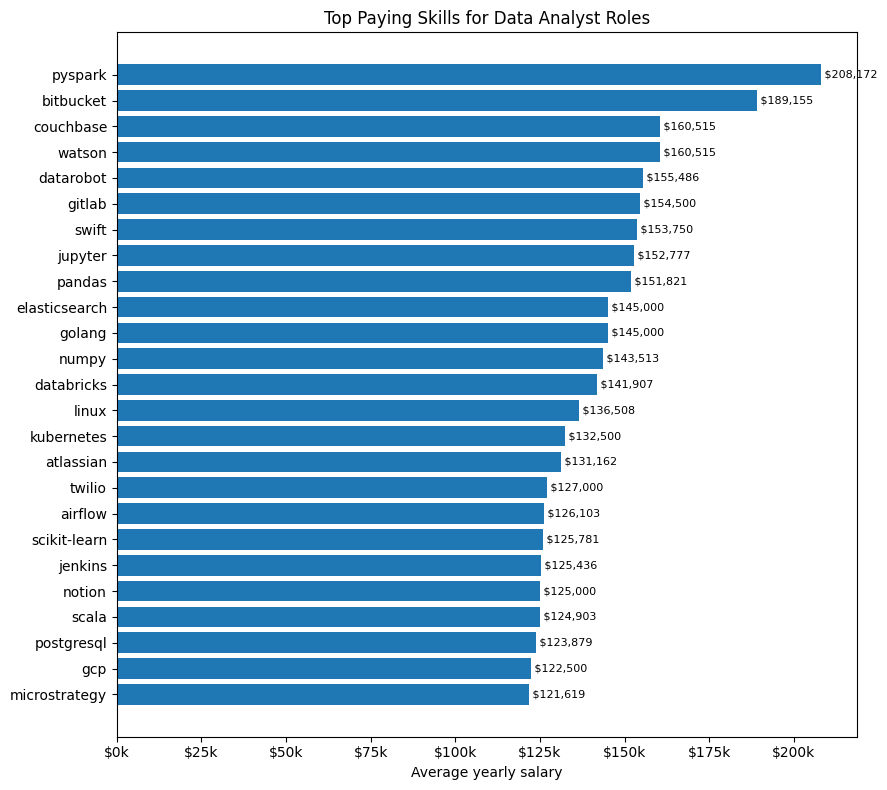
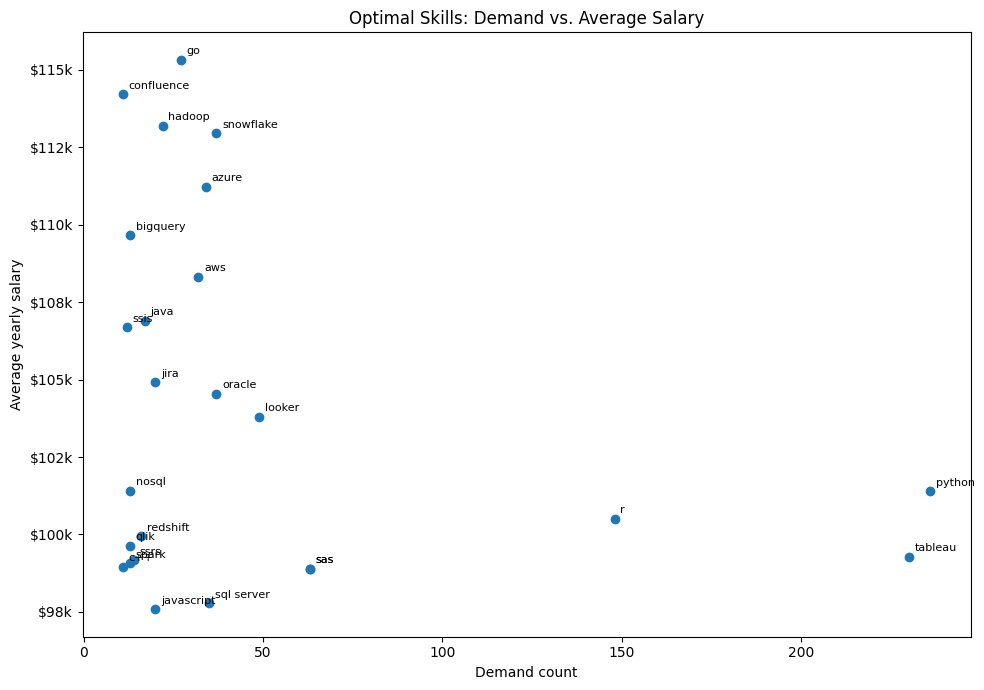

# Introduction
These queries focus on data analyst roles, exploring top-paying jobs, in-demand skills, and the intersection between high demand and high salary.

Check the queries out here: [project_sql folder](/project_sql/). Code snippets will aso be given in 'The Analysis' section next to their corresponding data visualizations.

# Background
The goal of this project was to navigate a mock data analyst job market to demonstrate an understanding of building and using SQL queries. Data comes from [SQL Course](https://lukebarousse.com/sql).

### The questions I wanted to answer through my SQL queries were the following:

1. What are the top-paying data analyst jobs?
2. What skills are required for these top-paying jobs?
3. What skills are most in demand for data analysts?
4. Which skills are associated with higher salaries?
5. What are the most optimal skills to learn?

# Tools I Used
- **SQL**: I learned much more on how to format SQL queries, both in terms of the order they need to be written and in the order of how they are executed. I utilized unions, joins, subqueries, CTEs, etc.
- **PostgreSQL**: I used this as my database management system, in particular for hosting the job posting data.
- **Visual Studio Code**: I used VSCode as the IDE for building SQL queries and database management.
- **Git And Github**: Both of these were needed for version control and sharing my SQL scripts and their analysis, demonstrating a mock project tracking environment.
- **ChatGPT**: ChatGPT was used to generate the graphs for the Analysis section.

# The Analysis
Each query investigated specific aspects of the mock data analyst job market data. Here's an outline of how I approached each question.

### 1. Top Paying Data Analyst Jobs
To identify the highest-paying roles, I filtered data analyst positions by average yearly salary and location, narrowing the search to remote jobs. This particular query shows the highest paying opportunities in the field.

```sql
SELECT job_id,
    job_title,
    job_location,
    job_schedule_type,
    salary_year_avg,
    job_posted_date,
    company_dim.name AS company_name
FROM job_postings_fact
    LEFT JOIN company_dim ON company_dim.company_id = job_postings_fact.company_id
WHERE job_title_short = 'Data Analyst'
    AND job_location = 'Anywhere'
    AND salary_year_avg IS NOT NULL
ORDER BY salary_year_avg DESC
LIMIT 10;
```

For a breakdown of the top data analyst jobs for 2023:
- **Wide Salary Range:** The top 10 data analyst roles span a pay range of 184,000$-650,000$, showing significant salary potential in the field.
- **Diverse Employers:** Companies like SmartAsset, Meta, and AT&T are among those offering high salaries, showing a broad interest across different industries.
- **Job Title Variety:** Particular job titles show a high diversity, from simply 'Data Analyst' to 'Director of Analytics,' reflecting varied roles and specializations within the data analyst subset.

<p align="center">
  
</p>

<p align="center">
  <em>Salary for the top 10 paying jobs for data analysis; all graphs generated via ChatGPT from my SQL query results</em>
</p>

### 2. Count of Top Paying Job Skills
Using the result of the last query as a nested subquery, this query filters the job_postings_fact table by the skills_dim and skills_job_dim tables to get all the skills present in these high paying jobs, aggregating them by count.

```sql
WITH top_paying_jobs AS (
    SELECT job_id,
        job_title,
        salary_year_avg,
        name AS company_name
    FROM job_postings_fact
        LEFT JOIN company_dim ON company_dim.company_id = job_postings_fact.company_id
    WHERE job_title_short = 'Data Analyst'
        AND job_location = 'Anywhere'
        AND salary_year_avg IS NOT NULL
    ORDER BY salary_year_avg DESC
    LIMIT 10
)
SELECT skills,
    COUNT(*) AS skill_count
FROM top_paying_jobs
    INNER JOIN skills_job_dim ON skills_job_dim.job_id = top_paying_jobs.job_id
    INNER JOIN skills_dim ON skills_dim.skill_id = skills_job_dim.skill_id
GROUP BY skills
ORDER BY skill_count DESC,
    skills ASC;
```

For the count of top paying skills of 2023, among the top 10 highest paying data analyst jobs:
- **SQL Top Spot:** SQL came out as the top skill among the highest paying data analyst jobs, barely eeking out Python at a count of 8 to Python's 7.
- **ML Learning Shift:** Python, r, numpy, and pyspark being among the highest paying skills shows the broader trend of a movement towards machine learning solutions to handling data analysis problems.

<p align="center">
  
</p>

<p align="center">
  <em>Skills possessed by the top 10 paying data analyst roles with the skills ranked by their average associated salary</em>
</p>

### 3. Top Demanded Skills
To determine the skills most frequent in the job_postings_fact table, COUNT was used to aggregate all skills returned by filtering this fact table by the previously mentioned skills_dim and skills_job_dim dimension tables.

```sql
SELECT skills,
    COUNT(skills_job_dim.job_id) AS demand_count
FROM job_postings_fact
    INNER JOIN skills_job_dim ON job_postings_fact.job_id = skills_job_dim.job_id
    INNER JOIN skills_dim ON skills_job_dim.skill_id = skills_dim.skill_id
WHERE job_title_short = 'Data Analyst'
    AND job_work_from_home = TRUE
GROUP BY skills
ORDER BY demand_count DESC
LIMIT 5;
```

For the most demanded skills, as measured by their prevalence in job postings:
- **SQL Ubiquity**: SQL showed up the most frequently of any one skill, at a count of 7,291 to Excel's 4,611, demonstrating the ubiquity of relational modeling in data analysis. As demand from companies for inputting semantic models of business insight data into machine learning models, I would expect this frequency distribution to grow in SQL's favor.
- **Data Visualization/BI Dominance:** In keeping with this demand for increased analysis into business insights, skills like Tableau and Power BI can be seen at the 4th and 5th respective spots. Excel, a common legacy platform for generating KPIs and BIs, can also be seen at 2nd on the list.

<p align="center">
  
</p>

<p align="center">
  <em>Counts of various skills associated with data analysis roles, ranked by frequency</em>
</p>

### 4. Average Pay of Top Paying Skills
To get the average pay of skills, I ranked skills by a rounded average salary, removing nulls and filtering for remote work.

```sql
SELECT skills,
    ROUND(AVG(salary_year_avg), 0) AS avg_salary
FROM job_postings_fact
    INNER JOIN skills_job_dim ON job_postings_fact.job_id = skills_job_dim.job_id
    INNER JOIN skills_dim ON skills_job_dim.skill_id = skills_dim.skill_id
WHERE job_title_short = 'Data Analyst'
    AND salary_year_avg IS NOT NULL
    AND job_work_from_home = TRUE
GROUP BY skills
ORDER BY avg_salary DESC
LIMIT 25;
```

For the skills with the top average paying salaries for those who had them:
- **Data Science Dominant:** Many of the top 25 skills include those used for data science, including pyspark, jupyter, pandas, numpy, etc. This likely reflects broader market trends toward machine learning focus in the tech sector.
- **Cloud Focus**: Databricks and Twilio show some of the larger pattern of movement towards cloud based platform provider SaaS solutions.

<p align="center">
  
</p>

<p align="center">
  <em>Average salaries for all data analysis skills, ranked in descending order</em>
</p>

### 5. Optimal Skills, as a function of Demand vs. Pay
To determine which skills would be optimal for new or existing data analysis engineers to learn, I created two CTEs, joined by their skill_ids, and ranked them by average salary and then demand count, removing skills with a frequency of less than 10.

```sql
WITH skills_demand AS (
    SELECT skills_dim.skill_id,
        skills_dim.skills,
        COUNT(skills_job_dim.job_id) AS demand_count
    FROM job_postings_fact
        INNER JOIN skills_job_dim ON job_postings_fact.job_id = skills_job_dim.job_id
        INNER JOIN skills_dim ON skills_job_dim.skill_id = skills_dim.skill_id
    WHERE job_title_short = 'Data Analyst'
        AND salary_year_avg IS NOT NULL
        AND job_work_from_home = TRUE
    GROUP BY skills_dim.skill_id,
        skills_dim.skills
),
average_salary AS (
    SELECT skills_job_dim.skill_id,
        ROUND(AVG(salary_year_avg), 0) AS avg_salary
    FROM job_postings_fact
        INNER JOIN skills_job_dim ON job_postings_fact.job_id = skills_job_dim.job_id
        INNER JOIN skills_dim ON skills_job_dim.skill_id = skills_dim.skill_id
    WHERE job_title_short = 'Data Analyst'
        AND salary_year_avg IS NOT NULL
        AND job_work_from_home = TRUE
    GROUP BY skills_job_dim.skill_id
)
SELECT skills_demand.skill_id,
    skills_demand.skills,
    demand_count,
    avg_salary
FROM skills_demand
    INNER JOIN average_salary ON skills_demand.skill_id = average_salary.skill_id
WHERE demand_count > 10
ORDER BY average_salary.avg_salary DESC,
    skills_demand.demand_count DESC
LIMIT 25;
```

For skill demand vs average salary:
- **Narrow Y-axis Band after filering:** The image gives an exaggerated view of an only ~17k salary gap, indicating that removing skills with a frequency of less than 10 in the SQL query removed many of the outlier skills with disproportionately high relative salaries.
- **SAAS development:** The presence of Azure and AWS among the higher paying skills, with low demand, indicate a budding field surrounding cloud compute and cloud storage for data analysis pipelines. These represent good skills for new or established data analytics engineers to learn.

<p align="center">
  
</p>

<p align="center">
  <em>Demand Count vs. Average Yearly Salary, with skills of demand < 10 removed</em>
</p>

# What I Learned
This project refreshed many skills for me. In particular, it honed my familiarity with SQL, gave me experience in working directly with mock relational data and database management servers, and some familiarity with the integration of SQL with VSCode. I also got experience uploading files to version control software via Git and GitHub, and learned more about some basic markdown and HTML formatting.

# Conclusions
I plan to further develop my skills with relational databases, in particular by getting a better understanding of niche SQL functions pertaining to Microsoft Fabric, as well as familiarizing myself with T-SQL, KQL, M code, DAX, and more. I hope to better grasp an overarching understanding of the data processing/analysis pipeline, so I can integrate myself within the data engineering field.